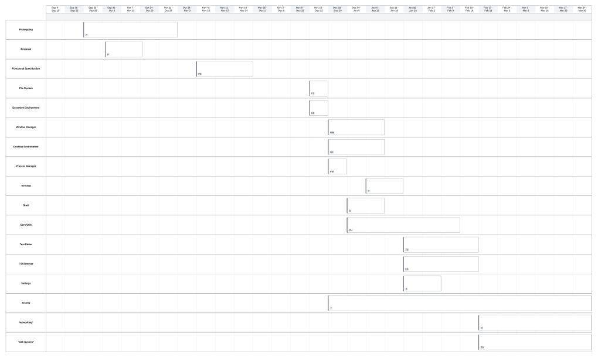

# 0. Table of Contents

# 1. Introduction

## 1.1 Overview

We are developing a platform agnostic Unix-like integrated development
environment for the purposes of educating the youth about programming in a more
"systems-orientated" way. While we say it is an "integrated development
environment" we are not referring to the typical colloquial meaning, often
shortened to IDE. The system we are building does not hide the execution
environment from the programmer and a user will need to learn some of the
standard Unix command-line tools. Crucially such tools are more trimmed down as
to not overwhelm the user. 

On top of the base execution environment we have a simple but familiar graphical
interface along with tools like a text editor, terminal, file browser, etc. The
system itself will be a client side web application for the purposes of
supporting as many devices as possible. Additionally, if time permits, we would
like to enhance the learning experience with a peer-to-peer task delivery system,
where a mentor can give programming problems to students - but this isn't part of
the core system.

Overall learning tools in programming try to hide a lot of valuable details away
from the programmer. While this is done to reduce learning overhead of
programming, there is a steep ramp in knowledge to escape such environments. We
made the observation that a big part of why learning systems and execution
environments is difficult is because of the amount of features (including
legacy) that the tools and APIs they provide have. The system we are building
tackles this issue rather than hiding it all together, we simplify the tools and
APIs and centralize execution, the idea is to give new programmers a broader
model of a simpler system that is based on the larger Unix-like systems
programmers come accustomed to as they grow. The system we are building is
hopefully a system that people can use as practice for learning larger systems.

## 1.2 Business Context

There is no business context. 

This project will be released under the free open-source software (FOSS) ideology, with no intentions of monetisation or license restrictions.

## 1.3 Glossary

| Term | Description |
|------|-------------|
| **API (Application Programming Interface)** | A set of rules and tools that allows software applications to communicate with each other, enabling interactions between different components of a system. |
| **Browser Platform** | The environment provided by a web browser for running web applications, including access to browser APIs, rendering engines, and execution capabilities like JavaScript and WebAssembly. |
| **Core Utils** | A set of essential command-line utilities commonly found in Unix-like operating systems, such as `ls`, `cp`, and `rm`. They enable basic system operations like file management and process interaction. |
| **File System API** | A programming interface that allows applications to interact with a file system, such as creating, reading, or modifying files. In browsers, this refers to the File System Access API. |
| **File System Access API** | A web API that allows browser-based applications to interact with files and directories on a user's device securely, within sandboxed constraints. |
| **Lua** | A lightweight, embeddable programming language often used for scripting. Known for its simplicity and ease of learning, making it suitable for educational purposes. |
| **Mentor** | An individual with intermediate to expert knowledge in programming and systems who guides students in learning, often by providing tasks and feedback. |
| **NAT Traversal** | A technique used to establish peer-to-peer connections across network address translators (NATs), which often block direct connections between devices. |
| **Peer-to-Peer (P2P)** | A decentralized networking model where devices communicate directly with each other without relying on a central server. |
| **POSIX Compliance** | Adherence to a standard for maintaining compatibility between operating systems, defining APIs, utilities, and shells for Unix-like systems. |
| **Sandboxing** | A security mechanism that isolates running programs to prevent them from affecting the host system or accessing sensitive resources. In browsers, web applications are sandboxed to restrict access to system resources. |
| **Shell** | A command-line interpreter that allows users to interact with the operating system by executing commands, managing files, and running scripts. |
| **Stun/Turn Servers** | Network servers used in peer-to-peer communications to facilitate NAT traversal by discovering public IP addresses (STUN) or relaying traffic (TURN) when direct connections fail. |
| **System API** | A programming interface that provides access to system-level functionalities such as managing files, processes, and windows, typically through high-level abstractions. |
| **Systems Literacy** | The level of understanding and competence in interacting with and manipulating system-level components like file systems, processes, and APIs. |
| **Task System** | A feature that allows mentors to create, distribute, and track programming tasks for students, often involving test cases and validation mechanisms. |
| **Terminal Emulator** | A software application that mimics the functionality of a hardware terminal, providing a text-based interface for users to interact with the shell. |
| **Unix-like System** | An operating system or environment that shares characteristics with the Unix operating system, including its command-line interface and file system structure. |
| **WebAssembly (Wasm)** | A binary instruction format for a stack-based virtual machine that enables near-native performance for web applications. It is often used to run code written in languages like C, C++, or Rust in the browser. |
| **WebRTC (Web Real-Time Communication)** | A web API and protocol that enables real-time audio, video, and data communication between web browsers and devices. Often used for peer-to-peer connections. |
| **Window Manager API** | A programming interface that allows the creation and manipulation of graphical windows within an operating system, such as resizing or repositioning them. |

## 2. General Description

### 2.1 Product / System Functions

#### 2.1.1 Primary Functions

Below are the main functions of our system, and are deliverables for our project.

##### 2.1.1.1 Code Execution Environment

A code execution environment will provide a context in which code can execute on
our system. As a foundation for a basic environment, we will be integrating a
**lua interpreter** into our operating system.

This will allow students to improve their programming skills, and provide a
means to interact with their system via code.

##### 2.1.1.2 Desktop User Interface

A desktop user interface will improve the familiarity of our system to the
student user. Our primary assumption is that most students will have familiarity
with Windows operating systems, and ideally we would like to prepare users to
eventually migrate to Linux, so we plan on implementing a user interface that
meets in the middle of these two.

There will be a desktop where the user can store files. There will also be a task-bar where core and open applications will be pinned. We will be aiming to mimic a familiar desktop environment for the user.

##### 2.1.1.3 Core Applications

In order to be perceived as a full-fledged operating system, we will provide necessary 'core applications'. These applications should feel familiar, and in the scenario where they're not, feel intuitive to pick up.

###### 2.1.1.3.1 Terminal

A simple terminal emulator will be available on our operating system. This is where the user will be able to interact with our shell.

###### 2.1.1.3.2 Shell

A shell will be used by the user to interact with their system via the terminal, and to access their runtime environment. 

As our primary users (students) are assumed to have no experience with shells, we will be implementing a very 'stripped-back' and friendly shell.

The shell will support:

* pipes
* IO redirection
* path
* simples shell scripts

Additionally, shell scrips ran will affect the environment of the shell, as opposed to an isolated environment. So if a `cd` is performed in a shell script, it will affect the user's current shell instance. For this reason, shell scripts will solely be ran via the `exec` built-in keyword.

###### 2.1.1.3.3 Core Utils

We will be implementing simple but important core-utils for the user to utilise. The goal is to emulate linux environments, so we will be aiming to mimic their core-utils.

The minimum core utils implemented will be;

* ls
* cp
* cat
* echo
* cd
* rm
* man
* mv
* touch
* mkdir
* rmdir

###### 2.1.1.3.4 File Manager

As we are assuming our users to be non-technical and we are aiming to have our system feel familiar we will include a file manager. 

This will allow users not yet familiar with the 'command-line' to manipulate and view the state of their file system.

###### 2.1.1.3.5 Text Editor

The operating system will come packaged with a simple text editor. We want this to be simple and stripped back, with our inspirations being such editors like nano and notepad.

We want to detach users from the abstractions IDE's provide, and couple development tightly to the terminal.

The text editor will support basic syntax highlighting for shell and lua scripts, and file manipulation.

#### 2.1.1.4 System Interface/API

A simple system API will be available to the user, to allow them to manipulate the state of the system through code, encouraging 'system programming'.

All system APIs will be custom and high-level abstracts, as opposed to trying to aim for POSIX compliance, for a beginner-friendly entry to systems programming.

##### 2.1.1.4.1 File System API

Our file system will be accessible via an API. This will allow the user, through code, to;

* Create
* Open
* Read
* Write
* Close

##### 2.1.1.4.2 Window API

The user will have full access to the window manager, allowing them to create and manipulate windows. This further emphasises and encourages the user to manipulate their system via code, encouraging systems programming.

The user will be able to:

* Create new windows
* Resize existing windows
* Move existing windows
* Close existing windows

##### 2.1.1.4.3 I/O API

Process I/O will be incredibly stripped back, with only `stdin` and `stdout` streams, allowing the user to input and receive output to programs running on the system.

#### 2.1.1.5 File Storage

The system will be using the standardised web browser file system API to store files on the clients machine, and users will be able to interact with this file storage via our operating system's 'file system' acting as a proxy. It will perform as a typical and familiar file-system.

#### 2.1.1.6 Processes

Processes will be simulated and kept simple. They will contain exit codes and stdin and stdout streams.

Additionally, the user will be able to list processes, and be able to perform limited process management - specifically killing processes in the case of ill-defined programs.

### 2.1.2 Secondary Functions / Stretch Goals

Below are non-deliverables for our project, but are components we would like to be able to implement if the time is available.

#### 2.1.4 Task System

The task system is intended as an additional feature for our secondary demographic of mentors.

Tasks will be declared and defined in a serialisable format, which will then be sent over a network to consumers of these tasks.

A high-level example of a task;

* Title: `"Fizz buzz"`
* Test cases: `[{input: "10", expected: "1 2 Fizz 4 Buzz Fizz 7 8 Fizz Buzz"}, ...]`

##### 2.1.4.1 Application

The application will allow the creation of task definitions, and provide as an interface to allow mentors to send tasks to users wishing to receive them.

Additionally, it will report back to the mentor which users have completed what tasks while connections are open.

Furthermore, task completion will be validated by clients to avoid code being sent over networks and executed remotely on other's machines for security.

##### 2.1.4.2 Networking

The task system will utilise decentralised peer-to-peer networking as to avoid saving any state about users.

WebRTC will be utilised with specially modified signalling servers to support rooms. This is to avoid complications of NAT traversal, restrictive networks and other complications.

Mentors will create rooms and be able to broadcast tasks to all members of a room.

Furthermore, students will send signals to the room owner indicating successful completion of tasks, for the mentor to be able to keep track of progress.

### 2.2 User Characteristics and Objectives

#### 2.2.1 Primary Users

##### 2.2.1.1 Students / Young Learners

###### 2.2.1.1.1 Expertise

The expertise in this category is expected to be Novice. We do not expect this
user to have their first experience of computing in our system, and we do not
tailor it as such. Although upfront knowledge to use the system is low
especially once the application is opened.

###### 2.2.1.1.2 Objectives

The objectives of the system in the context of young learners are as follows:

* Teach fundamentals of Unix-like systems
* Teach programming as it fits into a broader environment
* Unify the execution environment and reduce overhead of learning programming

The system requirements are guided based on these objectives, these are
explained in context of the objectives below.

**Teach fundamentals of Unix-like systems**

The system should also provide a subset of the fundamental commands that would be
expected to exist on any Unix-like system. These commands should also be
trimmed down so as not to be overwhelming, with the help messages assuming less
about what the already knows user.

Since the commands are trimmed down their use cases are less broad, so it is
easier for the user to get an overall understanding of the what the key
functions of each of the commands are.

**Teach programming as it fits into a broader environment**

The system should not hide the canonical execution environment from the user.
The user will execute command-line programs through the shell to run their code.
We are not necessarily making execution of programs easier, but by simplifying
the tools and reducing abstraction we are trying to make computing less magical
and more comprehensible.

The user should feel like the programs they write are much the same as those
that they are using to write it.

**Unify the execution environment and reduce overhead of learning programming**

The system should be platform agnostic such that the actual operating system is
abstracted by our system. This is crucial as it reduces the barrier to entry for
individuals and also allows mentors to spend more time teaching the important
things. This in turn also reduces the overhead of learning programming as the
system is more predictable across users devices.

Our system is in contrast to other programming environments that platform
agnostic which fully hide execution from the user and restrict the user from
learning the system at play.

#### 2.2.2 Secondary Users

These are users associated with secondary functions / stretch goals.

##### 2.2.2.1 Mentors

###### 2.2.2.1.1 Expertise

The assumed expertise level of mentors is intermediate to expert.

Prior knowledge of programming and systems is expected, and as such the mechanisms within our system should feel familiar.

###### 2.2.2.1.2 Objectives

**Assist in teaching system programming concepts**

The system inherently succeeds in this objective as it provides an all-in-one environment to be able to create programs, run programs, and interact with the operating system.

As it is stripped back and designed purely for education, using it as a tool for education should be easy and feel natural to the mentor.

**Assign tasks and monitor student progress**

The task system will allow the mentor to create rooms for students to connect to.

It will also allow the mentor to define tasks, and broadcast them amongst students that have chosen to connect to this mentor.

Students will then report back their progress on successful validation of task solutions, which the mentor will be able to see.

**All-in-one environment, no set-up**

The system is all-in-one.

Not only does it provide the tools to create and run programs, but it itself is an entire environment with no dependencies. The user doesn't have to install various languages, IDE's, tools or anything else.

This makes teaching systems programming far more convenient for the mentor.

### 2.3 Operational Scenarios
End-to-end scenarios that best explain the user's perspective

#### 2.3.1 Primary Operational Scenarios
These are operational scenarios associated with primary functions, and are associated with deliverables.

##### 2.3.1.1 Students / Young Learners

###### 2.3.1.1.1 Writing a program

The user can open a text editor and create a new program file. The user can then write the contents of their program and save it.

###### 2.3.1.1.2 Running a program

The user can execute graphical programs by double clicking their icon, or by opening the terminal and running them by their command
name. If the program is not builtin and not placed in the special path the user must run the program by either running it directly with the 
interpreter or by running by entering the full path and the shell will look for a shebang to see what to pass it to.

###### 2.3.1.1.3 Manage the file system 

The user can manage their file system by opening the file manager application. They can open files and navigate directories as well as
create, delete and rename them.

Alternatively, the terminal and shell can be utilised by more experienced students to manage and browse their file system.

###### 2.3.1.1.4 Interacting with system interface

The user can write code that interacts with a system interface / API.

For example, a user could write a program that automatically creates a tiled layout of all their open programs' windows, by utilising the window manager API.

#### 2.3.2 Secondary Operational Scenarios

These are operational scenarios associated with secondary functions / stretch goals, and aren't associated with deliverables.

##### 2.3.2.1 Students / Young Learners

###### 2.3.2.1.1 Viewing a task description

The user can open the task application and view the tasks that they have been given by their mentor. They can also view whether they have
successfully completed.

###### 2.3.2.1.2 Submitting a task solution

The user can drag and drop a file from the file manager into the task application to submit the task or the user can right click on
a file in file manager and select to submit the task.

##### 2.3.2.2 Mentors

###### 2.3.2.2.1 Creating a task

The user can create a task in the task application either:

* Manually by typing in specific test cases
* Automatically, by running a program with test cases and capturing its output

This will then generate a task description which the user can send to connected peers.

###### 2.3.2.2.2 Uploading a task

The user can select any of their defined tasks, and then broadcast them to all connected peers.

###### 2.3.2.2.3 Receive feedback on student task completion

If a peer connected to the user has completed one of their tasks successfully, the user will receive that information through the application portal.

This information will be received in real-time.

**2.4 Constraints**

### 2.4 Constraints

#### 2.4.1 Primary Constraints
These are constraints of primary functions of this project, and are associated with deliverables.

##### 2.4.1.1 Browser Platform
Creating a web-based operating system inherently is limited by the browser's capabilities.

**CPU/GPU Usage**

Browsers limit the resources that a web application can access. Any heavy computations would be limited by this constraint.

**Memory Usage**

The browser enforces memory caps per tab which could cause slow-downs or even possibly crashes if our app consumes too much memory.

**Multi-Threading**

Web workers allow background execution, but they lack direct access to the DOM, and require messaging mechanisms. Certain tasks likely won't perform as efficiently as in native environments.

**Sandboxing**

Our system will rely heavily on the browser's File System Access API or similar provided interfaces by browsers. Access is limited to a virtual file system, we cannot access the host operating system's file system directly.

Additionally, browsers restrict low-level system access, so if we need to access any peripherals we'll need to ask for explicit permissions.

**Device Heterogeneity**

Browsers are used on everything from high-end gaming computers to low-powered chrome-books, so our application will need to understand it's constraints and scale accordingly.

**Inconsistent API Support**

While modern browsers are converging on standards, certain APIs may not work uniformly across all browsers.

##### 2.4.1.2 Design Constraints

**UI/UX Complexity**

The design needs to be responsive, adapting well to various screen sizes.

**Familiarity vs Originality**

Balancing a meet-in-the-middle design between Windows and Linux whilst ensuring an intuitive design might be tricky.

##### 2.4.1.3 Development Time

**Team Skill set**

We're tackling many new technologies such as WebAssembly, browser APIs and WebRTC to name a few. The learning curve could slow down development.

#### 2.4.2 Secondary Constraints
These are constraints of secondary functions / stretch goals of this project, and are not associated with deliverables.

##### 2.4.2.1 Peer-to-peer Networking
Peer-to-peer networking has it's own constraints, primarily when connections are outside of local networks.

**Network Restrictions**

Peer-to-peer networks rely heavily on techniques like stun/turn for NAT traversal. Users behind restrictive firewalls or other restrictions may have trouble connecting directly.

**Latency and Reliability**

Peer-to-peer networks inherently have higher latency than centralised systems due to unpredictable connection paths.

**Packet loss**

Users with poor internet connections might experience issues with task synchronisation or progress reporting.

## 3. Functional Requirements

In the following functional requirements, criticality is grouped into levels:

* High - crucial for system to operation
* Medium - not crucial for system operation
* Low - stretch goal

1 What must the system requirement?
2 How does it meet these requirements?

### 3.1 Bootstrap System

**Description**

The system should be respond differently depending on the state that it can read
available. A bootstrap process should check if a file system is already available
and use that when loading the application, otherwise it should create a new one.

**Criticality**

High - This is a core part of restoring the state of the system while also setting
up a new system correctly.

**Technical Issues**

There are three key technical issues we see:

* Data corruption - Corrupt data may cause configuration files to be read incorrectly, even if other files are not
  corrupted the system should have a way to restore default configurations and keep other files available.
* Unbootable states - If dependencies are managed incorrectly you could reach unbootable states in the system where
  it just hangs in dead lock.
* Restoring missing core files - If core application and program files are missing the system needs to be able to
  restore them.

**Dependencies With Other Requirements**

 * File System API - In order for the system to bootstrap, the file system API must be available.

### 3.2 Exit System

**Description**

The system should allow users to safely exit the operating environment. Upon exiting, the system must save the current state of the file system and running processes, ensuring no data is lost.

**Criticality**

High - Critical for preserving user data and ensuring consistent state when restarting.

**Technical Issues**

 * State persistence - Ensuring the file system and process states are saved correctly and without errors.
 * Interrupt Handling - Prevent users from force-closing the system in ways that could cause data loss.

**Dependencies With Other Requirements**

 * File System - To save current state persistently.
 * Processes - Running processes must be terminated or saved gracefully.

### 3.3 Open Application

**Description**

Users should be able to open applications (e.g., terminal, text editor) through the taskbar or desktop. Applications should open in individual windows managed by the system's window manager.

**Criticality**

High - Fundamental to the system's usability and functionality.

**Technical Issues**

 * Window Initialisation - Ensuring the application is correctly instantiated within the window manager.
 * Resource Allocation - Applications must be allocated sufficient memory and resources without exceeding browser limits.

**Dependencies With Other Requirements**

 * Window Manager - For displaying and managing application windows.
 * File System - Applications like the text editor rely on the file system to open files.

### 3.4 Manage Windows

**Description**

Users should be able to manage windows by resizing, moving, minimizing, maximizing, and closing them. This functionality will enhance the desktop's usability and familiarity.

**Criticality**

Medium – Improves usability but not strictly essential for basic operation.

**Technical Issues**

 * Boundary Management - Preventing windows from exceeding the screen bounds.
 * Event Handling - Managing user interactions like drag-and-drop and resize efficiently.

**Dependencies With Other Requirements**

 * Desktop Environment - Windows must interact seamlessly with other desktop components like the taskbar.
 * System API - Programmatic controls over windows relies on the API.

### 3.5 Browse File Manager

**Description**

Users should be able to navigate directories, view files, and perform basic operations (e.g., create, delete, rename) through a graphical file manager.

**Criticality**

High - Core functionality for interacting with the file system in a user-friendly way.

**Technical Issues**

 * File Operations - Ensuring operations like deleting or renaming are reflected correctly in the file system.
 * Permission Management - Although we're not implementing user permissions, we do need to prevent unauthorized modifications to core system files.

**Dependencies With Other Requirements**

 * File System - Provides the data and operations for browsing and managing files.
 * Desktop Environment - File manager must integrate seamlessly as a desktop application.

### 3.6 Read a file

**Description**

Users should be able to open and read files, either through the file manager or programmatically using the file system API.

**Criticality**

High – Fundamental for interacting with stored data.

**Technical Issues**

 * Encoding Handling - Ensuring files are read with the correct encoding (e.g. UTF-8).
 * Large Files - Efficiently reading and displaying large files without exceeding memory limits.

**Dependencies With Other Requirements**

 * File System API - Provides methods for reading files programmatically.
 * Core Applications - Applications like the text editor require this functionality.

### 3.7 Write a file

**Description**

Users should be able to save data to existing files or create new ones, either through the file manager or programmatically via the file system API.

**Criticality**

High – Core functionality for user productivity and learning.

**Technical Issues**

 * Atomic Operations - Ensuring file writes are atomic to prevent partial writes during interruptions.
 * Disk Quota Management - Handling scenarios where browser storage quotas are exceeded.

**Dependencies With Other Requirements**

 * File System API - Provides methods for writing files programmatically.
 * Core Applications - Applications like the text editor require this functionality.

### 3.8 Run a command

**Description**

Users should be able to execute commands via the shell, which interacts with the system to perform operations like running programs, managing files, and piping output between commands.

**Criticality**

High – Essential for teaching shell and Unix-like system usage.

**Technical Issues**

 * Command Parsing - Properly parsing and validating user input to avoid errors
 * Process Management - Ensuring commands spawn and terminate processes correctly.

**Dependencies With Other Requirements**

 * Shell - Interprets and executes the commands.
 * Processes - Commands often result in spawning new processes.

**Others as Appropriate**

### 3.9 Execute a file

**Description**

Users should be able to execute program files, with the system determining the correct interpreter (e.g., Lua) based on the file's shebang or extension.

**Criticality**

High – Core functionality for enabling programming and systems learning.

**Technical Issues**

 * Interpreter Selection - Identifying and invoking the appropriate interpreter based on file metadata.

**Dependencies With Other Requirements**

 * Shell - Handles the execution request and interpreter lookup.
 * Execution Environment - Runs the program within the browser's constraints.

**Others as Appropriate**

### 3.10 Interface with system API

**Description**

The system should provide an interface for the user to be able to program the system. This should allow the user
to manipulate the file system:

* Open files
* Create/Delete files
* Create/Delete directories
* Read/Write from/to files

The system should also expose functionality to create windows. These windows should also provide primitive drawing
functions on them. All windows should be able to be programmatically manipulated by using the system interfaces: i.e.
not just those opened by a given program.

IO operations like printing to stdout or reading from stdin are also provided by the system API.

**Criticality**

High - These interfaces are core part in program execution. Especially important is input and output or some graphics, programs
without this are not verifiable and not very interesting.

**Technical Issues**

The key technical issue is to integrate across multiple different components -
the system API interacts with vastly different things, it will need to call on
many different web API's: web assembly API's, web workers API's, canvas drawing
API's. As well as directly using web API's it will also draw on custom API's
from dependant systems. Integration with web assembly code can become very
complicated due to how primitive web assembly is as well as its limitations.

Essentially the state surface area is large.

**Dependencies With Other Requirements**

The system API depends on the File System for file operations and the Window
Manager for window creation and manipulation.

### 3.11 Create Task Rooms*

**Description**

Through a custom signalling server clients can create task rooms via the task
application. A unique room id, is produced to the client so that it can share it
with other clients that want to connect. The task room is a peer-to-peer
connection between other clients. The client that creates the room acts as the
central client where all other clients are peripheral.

**Criticality**

Low - This is a stretch goal, and the system stands on its own feet without it.

**Technical Issues**

There are some key issues to tackle:

* The signalling server needs to support and manage multiple task rooms.
* Management of realtime communication.

**Dependencies With Other Requirements**

No dependencies.

### 3.12 Join Task Rooms*

**Description**

Clients should be able to join task rooms via their respective task id that is
generated when creating a task room. A client can only be in one task room at a
time, the signalling server should enforce this. Joining a task room involves
asking the signalling server to join the task room given the id and once joined
the client can act as a peripheral receiving tasks from the central client.

**Criticality**

Low - This is a stretch goal.

**Technical Issues**

* Handling inconsistent connections - essentially avoiding issues of client
disconnections not being represented by the signalling servers state that it is
actively operating on. This state must be handled without the assumption that
that it is always valid.
* How do clients respond to signalling server going down? - The clients should
  not assume the signalling server is able to connect them successfully.

**Dependencies With Other Requirements**

This depends on "Create Task Room" as joining a task room is an operation for the
peripheral clients, the central client connects when it creates the room.

### 3.13 Leave Task Rooms*

**Description**

Clients should be able to leave task rooms such that they are free to join a
different task room. When a client leaves a task room, it will no longer store
or be able to receive tasks from the central client and can no longer signal the
central client that it has completed any.

**Criticality**

Low - This is a stretch goal. However we do see it as important if joining and creating
task rooms is implemented.

**Technical Issues**

* Handling the life-cycle of peers. Essentially when a client leaves a room how does the state of the
  system represent this?

**Dependencies With Other Requirements**

This only depends on "Create Task Room" as that is the bear minimum for a client to be connected
to a room.

### 3.14 Submit Task Solution*

**Description**

Using the task application interface a user can submit a task solution by
directly submitting a file from a menu in the file manager application or by
dragging the file into the task application. Task solutions are only accepted
for tasks that were published in the current task room session. Submitting the
task should run the program and check that the hash of the output matches the
expected hashed output, if every input and hashed output pair run successfully
the client will signal the central client that they successfully completed the
task.

**Criticality**

Low - This is a stretch goal.

**Technical Issues**

Ensuring clients cannot overload the central client by submitting a correct task
solution multiple times. Restrictions need to be put on both peripheral and
central clients so that a fixed window for submission is maintained per client.

**Dependencies With Other Requirements**

This depends on "Create Task Rooms" and "Join Task Room" as both a task room needs
to be created as well as some peripheral client joining it for task submission to
be a possibility.

### 3.15 Publish a Task*

**Description**

Publishing a task involves a central client submitting a task configuration
which includes a list of input and hashed output pairs, the name of the unique
name of the task program as well as on optional timeout field to specify the
limit on execution time for the task. A user can submit this configuration via
the task application and after submission can in the same place view the names
of the clients that have completed the task.

**Criticality**

Low - This is a stretch goal, 

**Technical Issues**

When a new client is connected they must receive the previously published tasks
that are saved on the central client. Clients will need to validate published
tasks, as if the task description gets corrupted or mangled in transit it
submitting correct solutions could come back as incorrect.

**Dependencies With Other Requirements**

This depends on "Create Task Rooms".

### 3.16 Configure System

**Description**

A simple configuration file is kept on the file system to allow users to
customize the appearance of the system. For example the user can change
colors and font size of different parts of the system.

**Criticality**

Medium - While not its function is not depended upon by other systems, it is important
for accessibility reasons and to allow users to make their system more to their liking.

**Technical Issues**

The main issue would be making sure invalid configuration does not break other parts
of the system, as well as putting in safe guards for the configuration to be reset back
to a good state if the user finds issues.

**Dependencies With Other Requirements**

The configuration itself does not depend on functional requirements however the things
it specifies implies a wide range of the system is functioning.

### 3.17 Save Files to Desktop*

**Description**

Files can be accessed as shortcuts on the desktop. The files are read from a special
directory on the file system.

**Criticality**

Low - Files are still accessible through the file manager and the shell, so this is not
crucial for system operation.

**Technical Issues**

Deciding how to update the shortcuts by reading the special directory. Drag and drop
UI is complicated, involving interaction of user input and how the currently dragged item
interacts with the other items on the desktop.

**Dependencies With Other Requirements**

This depends on "Interface with system API" for reading files.

## 4. System Architecture

### 4.1 Minimum Viable Product

#### 4.1.1 User Interface (UI)
Explanation

##### 4.1.1.1 Window Manager
Explanation

##### 4.1.1.2 Desktop Environment
Explanation

#### 4.1.2 Execution Environment
Explanation

#### 4.1.3 File System
Explanation

#### 4.1.4 Process Manager
Explanation

#### 4.1.5 Core Applications
Explanation

##### 4.1.5.1 Terminal
Explanation

##### 4.1.5.2 Settings
Explanation

##### 4.1.5.3 File Browser
Explanation

##### 4.1.5.4 Shell
Explanation

##### 4.1.5.5 Text Editor
Explanation

### 4.2 Stretch Goals

#### 4.2.1 Task System
Explanation

#### 4.2.2 Networking
Explanation

## 5. High-level Design

### 5.1 Creating and Running Programs Sequence Diagram

### 5.2 File System Initialisation State Diagram

### 5.3 Window API Interaction Sequence Diagram

### 5.4 Stretch Goal Create and Broadcast Task Sequence Diagram

### 5.5 Stretch Goal User Uploading Task

## 6. Preliminary Schedule

