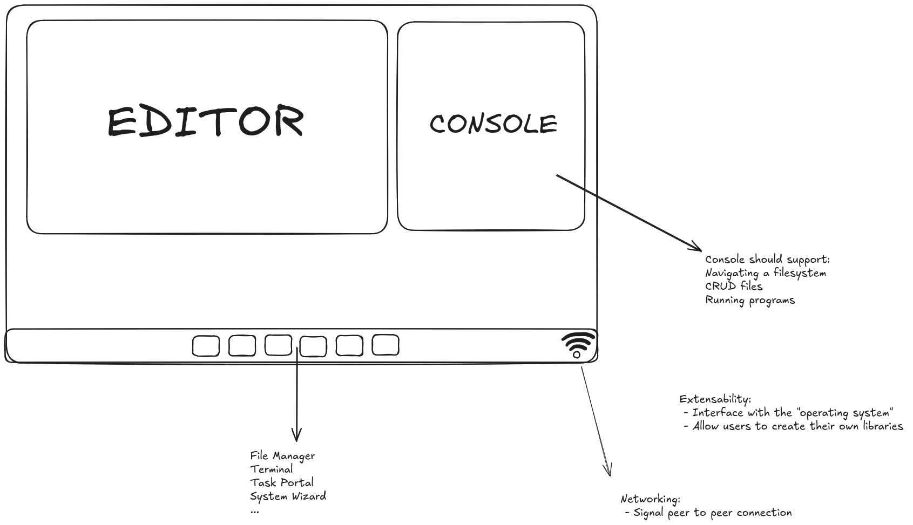
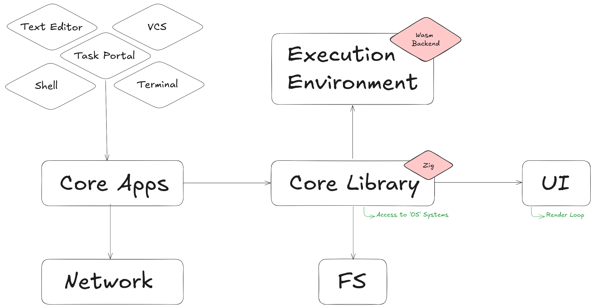

# School of Computing &mdash; Year 4 Project Proposal Form

## SECTION A

|                     |                     |
|---------------------|---------------------|
|Project Title:       | Hako                |
|Student 1 Name:      | Niall Ryan          |
|Student 1 ID:        | 21454746            |
|Student 2 Name:      | Cathal O'Grady      |
|Student 2 ID:        | 21442084            |
|Project Supervisor:  | Prof. Stephen Blott |

## SECTION B

### Introduction

Accessiblity of computers is as high as ever, and still rising, no longer do you need specialized skills to make use of a computer. While this has its obvious benefits for broader humanity, for those who are looking into more specialised areas in Computing, the level of abstraction that is presented leaves a complex and difficult system to understand, we consider this a barrier to *Systems Literacy*.

We believe that *Systems Literacy* is a crucial part of computer science as it motivates otherwise mundane tasks as a challenge in understanding the underlying systems at play. We want to shift the perspective of code to be a means for extracting value from computers, rather than a disjoint activity, whos output is disconnected from the system you are interacting with.

To achieve this we propose a design of a simpler, platform-agnostic system that is constrained by design. The goal of which is to promote programming of the very environment you are using to write code.

### Outline

#### Overview

Hako is an education tool intended to fully expose programming in its entirety to those looking to learn.

We believe there aren't existing solutions out there delivering the experience we envision. Not only will we expose new programmers to coding, but the main attraction of our system is an abstracted operating system with an easily accessible system API.

In pursuit of encouraging the use of the underlying system we will also have a highly simplified shell, terminal, filesystem, and more. We will be fully encouraging the user to explore the entire system, use it, and understand it.

Additionally, our system will be extensible, users can program their own applications, workflows, automations - whatever they so choose. Crucially, we are showing them how code fits into the broader system itself.

Our inspirations are rooted in unix-like operating systems. We want to share the experience of learning one in a more focused manner. 

Unix was an operating system that from the start broke down the barriers of entry to programming, and we want to continue this vision with a focus on the youth. 

However a caveat of targeting children, is sensitivity of data. We plan on mitigating this via a decentralised approach. 

Utilising a peer-to-peer real-time communication protocol, we solely use servers to match clients together. This way we store no user-data.

#### System Architecture

*Diagram displaying the client architecture*

##### Core Library

This is the user-facing system API.

##### Core Apps

These are a collection of the core applications in our operating system.

Core applications consist of:
 - Text Editor
 - Terminal
 - Lua interpreter
 - Shell
 - Task Portal
 - Settings Wizard
 - File explorer

Other applications we'd like to implement as **stretch goals**:
 - Simplified Version Control System
 - Python or other extra interpreters
 - Simple Whiteboard/Drawing utility

##### Network

This is the portion of the system that will interface with other clients.

##### UI

We will be utilising the GPU to render our operating system's user interface on the web using WebGL.

This will require the creation of our own or utilisation of existing frameworks such as an immediate mode gui, or a framework such as PixiJS.

##### Execution env

This is an environment in the browser that allows for the execution of arbitrary 'user-space' code.

It will be protected as to not modify or heed the overall system operation.

##### Filesystem

The filesystem will be persistent and stored on the clients machine, so they have full ownership of their own data.

#### Client

This consists of the actual web-based operating system, and is entirely the system users interact with.

#### Server

The server is exclusively used for clients to discover and connect to eachother in our peer-to-peer real-time communication protocol.

It will be easy to set-up, and in an actual setting would likely be ran by a teacher/mentor in a classroom/lab setting.

#### Task System

The task system will be peer-to-peer. A task will consist of a description and input. One client will act as a master that produces tasks to subscribers, the subscribers can respond back with the output after running their code and receive feedback on its correctness.

We will create our own specification for defining tasks, likely in a json or similar format.

### Background

#### Where Hako Began

Hako stems from our shared passion for both **learning** and **teaching** computer science, specifically programming for children. Over the years, Niall has worked with various pedagogical methods and platforms like [CodeAcademy](www.codeacademy.org), [Scratch](www.scratch.mit.edu), and [KhanAcademy](www.khanacademy.org). While these platforms do a great job teaching programming languages, we realized something was missing.

#### The Problem We Saw

Many educational platforms focus on just the **code** – they teach how to write it but rarely explore the environment where the code runs. This gap can leave learners without the critical skills needed to fully understand or troubleshoot code in the real world. **Systems literacy** is often neglected, largely because teaching native development usually means dealing with platform-specific non-functional challenges.

#### Our Solution

That's where Hako comes in. We're developing a **browser-based**, **platform-agnostic** environment that removes the complexity of current systems, in-turn promoting the exploration of the environment in which their code operates. We want to empower children not just to write code, but to interact with the system, reason about behaviour, and debug issues – skills essential for a well-rounded programmer.

#### Our Experience

 - Niall has spent **over a decade** teaching children programming concepts from the ages of 9 - 17, and has experience in Systems Programming.
 - Cathal is **deeply proficient** with Systems Programming, and has experience mentoring university-level students.

Together, we’ll shaped Hako to not just teach programming, but to bring systems literacy to the forefront. Our combined expertise in Systems Programming and Pedagogy gives us the tools to fill the gaps left by traditional programming education.

### Achievements

#### Target Users

Hako is an educational tool designed for individuals learning programming concepts. However, our primary audience is **children**, and we will craft the user interface and overall experience with their needs in mind.

Additionally, **teachers and mentors** will play a key role by using Hako to guide students and assign programming tasks.

Our target demographic is split into two groups;
 - **Students (Ages 9 - 17)** - Engaging young learners in systems and programming concepts.
 - **Mentors** - While there’s no specific age range for mentors, we assume a certain level of technical proficiency.

#### Functions Provided

##### User Interface

The user interface will simulate a familiar operating system, tailored specifically to the needs of children. Our goal is to create an environment that is **fun, intuitive, and immersive**, tricking the user into believing they are interacting with a full-fledged OS.

Key features include:
 - **Floating Window Manager**
 - **Desktop Environment**
 - **Toolbar**

##### Core Apps

The system will come equipped with essential, built-in apps designed to teach programming and system interaction. These core apps will include (but are not limited to):
 - **Text Editor**
 - **Terminal**
 - **Shell**
 - **Task System**
 - **File Explorer**
 - **Settings Wizard**

##### Execution Environment

In order to teach children programming concepts, and to further allow them to interact with our system, we will need to create an execution environment that allows children to execute arbitrary code. 

Although we could support multiple different languages, we will first support the **Lua programming language** due to its lightweight and embeddable nature.

##### Filesystem

A filesystem is crucial for students to manage their progress and save their work. However, due to the sensitive nature of our target demographic, we will not store any user-data. Instead, users will be storing their data on their own devices, facilitated by standard browser APIs.

### Justification

#### Why?

We have identified significant gaps in the current methods used to teach programming, particularly in the area of **systems literacy**. Most existing platforms focus on teaching how to code, but rarely emphasize understanding the environment in which that code runs. Without this foundational knowledge, students are limited in their ability to troubleshoot, reason about system behaviour, and become well-rounded programmers. Hako seeks to **bridge this gap** by teaching children to engage with and manipulate systems, not just write code.

#### When and Where?

Hako will be useful in **educational settings** where programming concepts are being introduced, such as:
 - **Classrooms and lab environments**: Teachers can use Hako to demonstrate how systems work and assign tasks that build on that knowledge.
 - **After-school coding programs**: Environments like CoderDojo can leverage Hako to enhance the systems literacy of young coders.
 - **Home-based learning**: Independent learners can use Hako to explore and practice coding in a fun and interactive way, supported by a rich systems-level experience.

#### How?

Hako accomplishes its educational mission by creating a **simplified system environment** with a **custom API**. This stripped-back operating system allows children to interact directly with the system, offering an experience similar to native development but without the baggage. Additionally, there will be a **task system** allowing mentors to share tasks to their students, and even encouraging students to share their own problems amongst eachother. By leveraging this platform, students can:
 - **Run code in real-time** through an interactive execution environment.
 - **Learn core systems concepts** through built-in applications like a text editor, terminal, and task system.
 - **Manage their projects** with a persisted filesystem that ensures privacy and security for young learners.
 - **Experience immediate feedback** from system interactions, mimicking real-world operating systems to make the learning process intuitive and rewarding.
 - **Complete, create and share tasks** from our custom task system, enabling mentors to push tasks onto their students systems, even allowing children to share their own interesting tasks.

### Programming language(s)

* **Javascript**:
  Targetting the browser, will need javascript for client code.
* **Zig**:
  For Wasm targetted client programs as part of GNU coreutils-like software (e.g. ls, cat, etc)
* **Wasm (C/C++)**:
  Apart from Zig, we also anticipate using other C/C++ tools or libraries. At the very least we will need to modify the build of a C/C++ program (e.g. lua or cpython).
* **Golang**:
  For the peer-to-peer connection establishment server as part of the task system.
* **Lua**:
  Lua is proposed to be used a simple language for user facing code to access/manipulate the system (akin C on linux).
* **Nix**:
  For maintaining a reproduceable development environment for both CI/CD and regular development. We don't want to do double work setting up the environment on each others machines.
* **Shell**:
  For glue code in the build process.

### Programming tools / Tech stack

* **Browser**
  - WebGL (likely version 2)
    Used for graphics/UI.
  - Browser File System API
    For interacting with persistent storage on the client.
* **Emscripten**
  For compiling C/C++ to wasm to be able to run in the browser.
* **WebRTC**
  For peer-to-peer connections
* **Containerd/Podman**
  For ease of hosting the WebRTC server
* **Zig Compiler**
* **Golang Compiler**
* **Lua Interpreter**
* **Just build system**
  A generic build system for managing our own builds as well as vendor dependency builds (e.g. lua interpretter)

### Hardware

Both client and server components target standard platforms, meaning they should run on any contemporary computing device.

### Learning Challenges

Cathal and Niall bring different expertise to this project, meaning each of us will face unique learning challenges. This section outlines the areas where one or both contributors will need to develop new skills as part of Hako's development.

#### Learning New Programming Languages

We've chosen certain programming languages for their suitability for this project, but the below particularly present a learning curve.
 - **Web Assembly** - A portable binary format that allows native execution in the browser. We will need to learn how to work with WebAssembly to effectively implement Hako's system components.
 - **Zig** - A modern, statically typed systems programming language. While it offers powerful features for system-level programming, Niall is not yet familiar with its syntax and conventions.

#### Learning New Tools / Technologies

We will also need to get up to speed on a range of tools and technologies that are crucial for Hako's development:
 - **Emscripten** - This LLVM/Clang-based compiler is essential for compiling C and C++ code into WebAssembly. Using it to port applications for browser execution will be new territory for us.
 - **WebRTC**- This real-time communication protocol will enable peer-to-peer networking for Hako. We are unfamiliar with WebRTC, so we will need to learn how to use it to facilitate decentralized networking.
 - **Nix** - As a declarative package manager, Nix will allow us to manage builds and development environments. Niall is not yet proficient with Nix and will need to invest time in learning its ecosystem.
 - **WebGL** - We'll use WebGL to render graphics within the browser, enabling 2D and 3D rendering using the GPU. Although familiar with some graphics APIs, using WebGL will be a new challenge.

#### Decentralised Networking

Neither of us are familiar with the ins-and-outs of decentralised networking, and becoming familiar with it will be a challenge.

#### Web Assembly Ecosystem

Working with WebAssembly to build core systems for Hako presents a number of challenges. We will need to learn how to:
 - **Develop with WebAssembly** as the target environment.
 - **Patch and port software** for execution in the browser.
 - **Use Emscripten's custom libc** to correctly compile applications for WebAssembly.
This process, from setup to final execution, is new to us, and learning how to harness WebAssembly's full potential will be one of the key challenges in the project.

#### Javascript/Browser APIs

We will need to familiarise ourselves with several JavaScript and browser APIs, including:
 - **Web Workers** for multi-threading.
 - **The browser's filesystem API** to enable persistent user-data.
These are areas we have little experience in, so mastering these will be essential for Hako's success.

#### UI/UX Design For Children

Designing an intuitive and engaging interface specifically for children is an entirely new area for us. Creating a system that is both educational and appealing to younger audiences presents a significant challenge, as children's user needs differ greatly from typical adult users.

#### Combination of Non-Conventional Technologies

While many of the technologies we plan to use - such as WebAssembly, WebRTC, and WebGL - are well-documented and supported by active communities, the challenge lies in our **specific use case**. We will be combining these technologies in a relatively **unusual environment**: a browser-based platform that simulates an operating system. Creating this type of system requires stitching together tools that are not typically used in this context. For example, using WebAssembly to manage a floating window manager or designing a complete execution environment with support for real-time peer-to-peer networking is not a common approach. The challenge will be **adapting these technologies** to work together in a cohesive and innovative way that mimics an OS-like experience for children.

#### Designing New Systems We're Unfamiliar With

We will also need to design and implement several complex systems that we've never worked on before, such as (but are not limited to):
 - A **custom execution environment**.
 - A **system API** to allow users to interact directly with the environment.
 - A **floating window manager** to simulate a familiar operating system experience.
These are ambitious goals, and developing these systems from scratch will require significant research and problem-solving.

#### User Testing

We have limited experience with formal user testing, and since our target audience consists of children, this introduces several additional challenges. We will need to:
 - Develop **clear protocols** for handling sensitive data.
 - Ensure **ethical considerations** are met, including parental consent and child safety.
 - Implement strict measures to **anonymise and secure user data**.
Balancing the practicalities of testing with ethical and legal obligations will be one of our largest hurdles.

### Breakdown of work

We will be attempting to split work according to our strengths, whilst still enabling both of us to learn new technologies. The breakdown of work is based on core systems of the project, and has been divided as:

#### Cathal
 - UI System
 - Execution Environment
 - Text Editor
 - Terminal

#### Niall
 - Networking
 - Task Portal
 - Filesystem
 - Shell

#### Shared
 - UI Design
